# Group 12

### _Contributors_

- Jonathan Meyer | mwjeth#7039
- Andy | 0xAndy#3968
- Beatriz Dominguez | BeatrizD#8939
- Anuja | anud#1704
- Pedro | pdroooooooo#5705
- BK | BK#7471
- Neeraj | innerpeace#5319

---

### Ballot Contract Report [Github Repo](https://github.com/bdomingu/encode-solidity-bootcamp-weekend-projects-group-12/blob/main/week2/REPORT.md)

#### The ballot contract is deployed on Sepolia Testnet and the address is: `0x66eb0E81E85952816f4e629a929ce3D5f2B36fDB`

#### Vote for the fav coffee proposals

- Proposal 0 - Dunkin
- Proposal 1 - Starbucks
- Proposal 2 - Tims
- Proposal 3 - Peet

---

- **Deployed Contract Transaction**
  > [hash](https://sepolia.etherscan.io/tx/0x41e112ad41c0909c7fc58fe7f3896bf1be679094d631c8a977d45b42b6fc02ae)`0x41e112ad41c0909c7fc58fe7f3896bf1be679094d631c8a977d45b42b6fc02ae`
- **successful `giveRightToVote` to `0x44C114C8a23628789FC5a133e7777C48e2c783c5`**
  > [hash](https://sepolia.etherscan.io/tx/0xe11e63dddff3ade694eeb6e03b030ddfe5bba1047466b02fb0181f27c13a92c1) `0xe11e63dddff3ade694eeb6e03b030ddfe5bba1047466b02fb0181f27c13a92c1`
  - > Etherscan img 
- **unsuccessful `vote` from `0xF6d38b257b4DD900BABe5B0f48A877943C0f1312` because of no permission to vote**
  - > 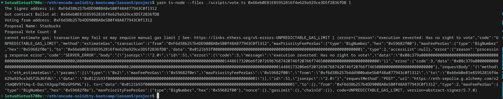
  - > 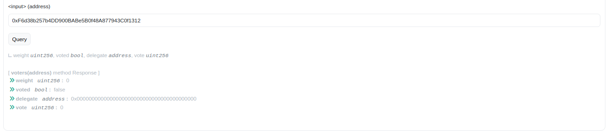
- **successful `vote` from `0xF6d38b257b4DD900BABe5B0f48A877943C0f1312`**
  > [hash](https://sepolia.etherscan.io/tx/0xe2f3ab681cb5502380e2993cbafa719438e2467ec1dd1bde292f4b4e4b8e8bbb) `0xe2f3ab681cb5502380e2993cbafa719438e2467ec1dd1bde292f4b4e4b8e8bbb`
  - > 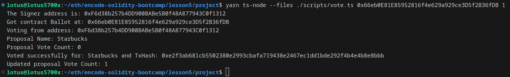
  - > 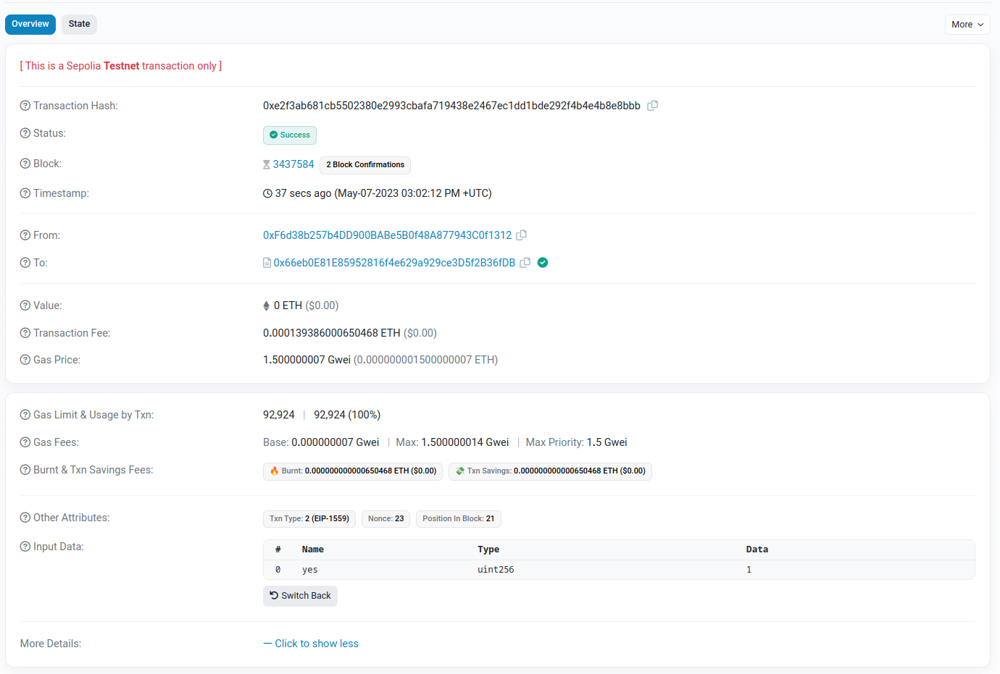
- **succesful `delegateVote` to `0x44C114C8a23628789FC5a133e7777C48e2c783c5`**
  > [hash](https://sepolia.etherscan.io/tx/0xd7495596d090e7538c0829371b2cb20dfc6a2ee6a058ae3150ee669ae46302ae) `0xd7495596d090e7538c0829371b2cb20dfc6a2ee6a058ae3150ee669ae46302ae`
  - > 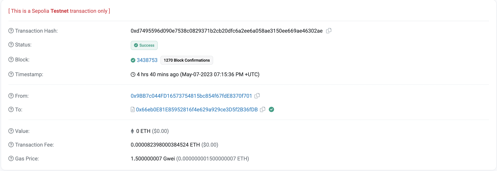
- **succesful `vote` from `0x44C114C8a23628789FC5a133e7777C48e2c783c5`**
  > [hash](https://sepolia.etherscan.io/tx/0x48e4d7c4c81d226a9d111de6a7ee48f8814760eb2c0eed060295c74a3adad2a4) `0x48e4d7c4c81d226a9d111de6a7ee48f8814760eb2c0eed060295c74a3adad2a4`
  - > 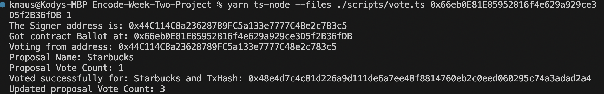
  - > 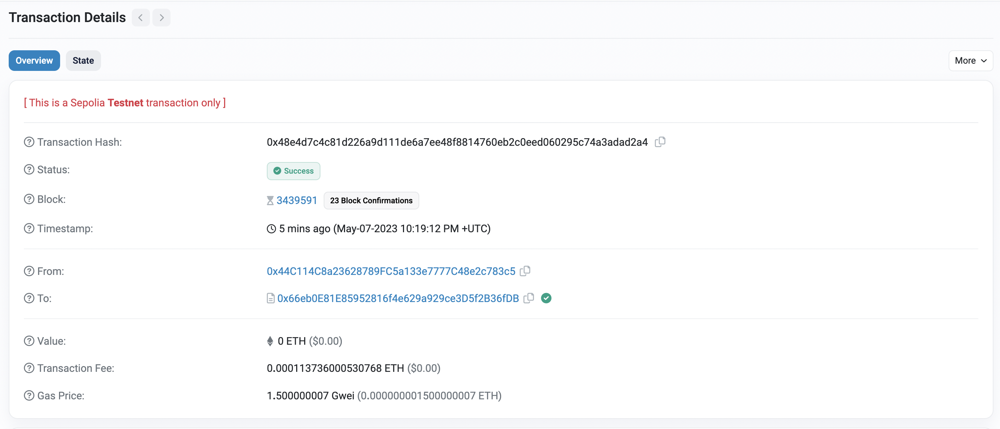
- **unsuccesful `delegateVote` from `0x44C114C8a23628789FC5a133e7777C48e2c783c5` to `0xe4d0C7536c8DbF5ab9D91259Df0549293eC14c34` because I had already voted with my address.**
  > [hash](https://sepolia.etherscan.io/tx/0xa9ec06fb92647ef69145cf73e6b98c747b15f9d4c4f565a775450583271d3daf)`0xa9ec06fb92647ef69145cf73e6b98c747b15f9d4c4f565a775450583271d3daf`
  - > 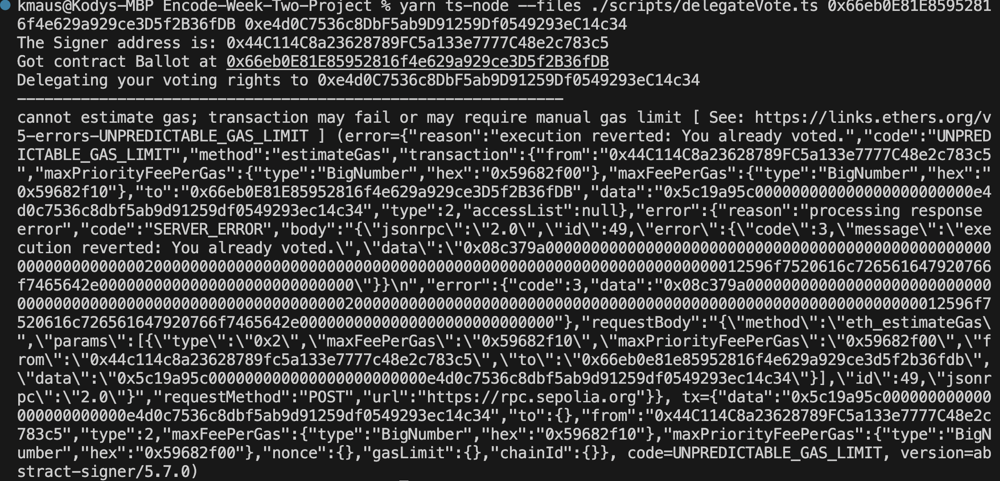
  - > 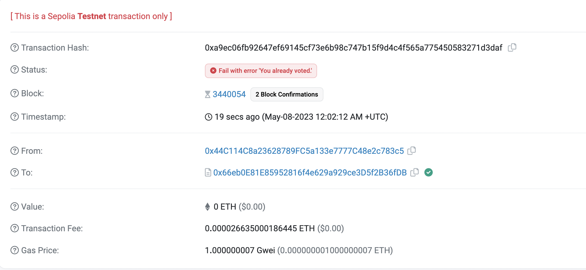
- **unsuccessful `giveRightToVote` from `0x44C114C8a23628789FC5a133e7777C48e2c783c5` to `0xe4d0C7536c8DbF5ab9D91259Df0549293eC14c34` because I am not the chair person and cannot grant right to vote.**
  > [hash](https://sepolia.etherscan.io/tx/0x7bf3f77c0924566daf82d5f92f30365655c48b70f90c153a3d4478c80e5b8d4b) `0x7bf3f77c0924566daf82d5f92f30365655c48b70f90c153a3d4478c80e5b8d4b`
  - > 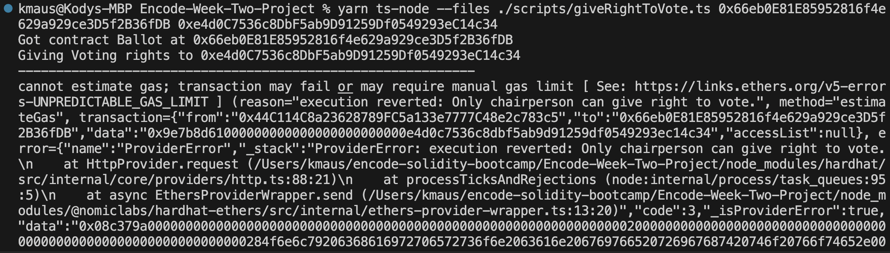
  - > 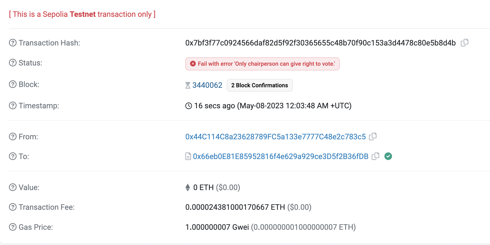
- **successful `giveRightToVote` to `0xe4d0C7536c8DbF5ab9D91259Df0549293eC14c34`**
  > [hash](https://sepolia.etherscan.io/tx/0x0ed0a661f3947be78df8ce14b290dca80a7f973ab4c30b1ff9f8cc664b0e64dd) `0x0ed0a661f3947be78df8ce14b290dca80a7f973ab4c30b1ff9f8cc664b0e64dd`
  - > 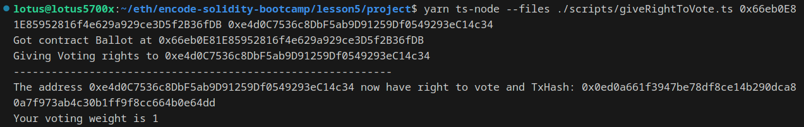
- **winning proposal script**
  - > 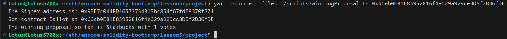
  - > 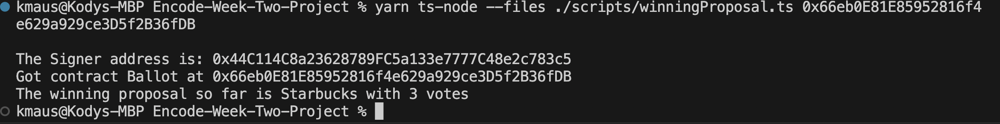
