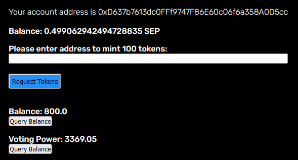
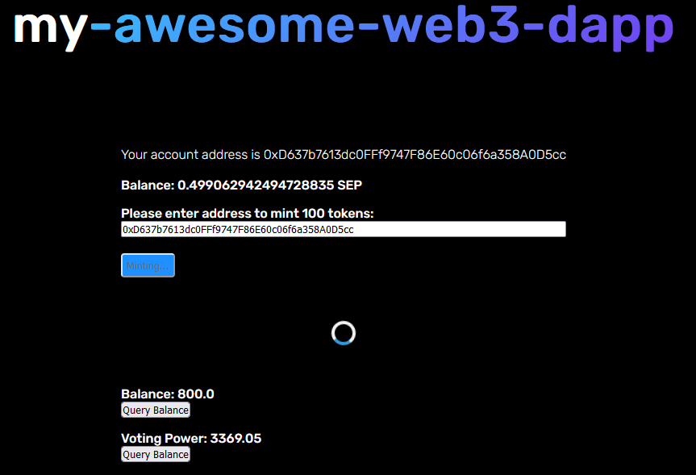
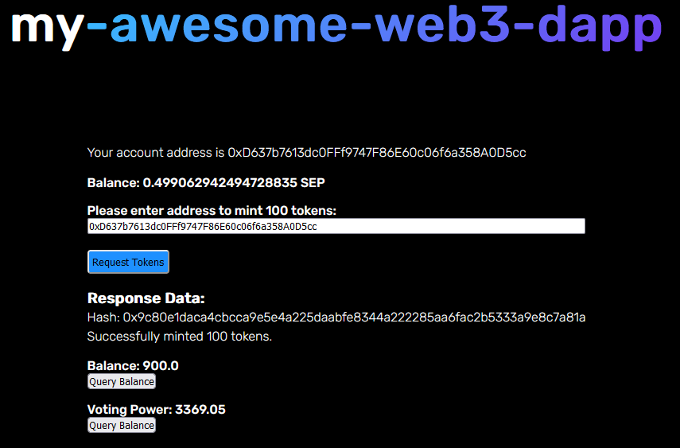
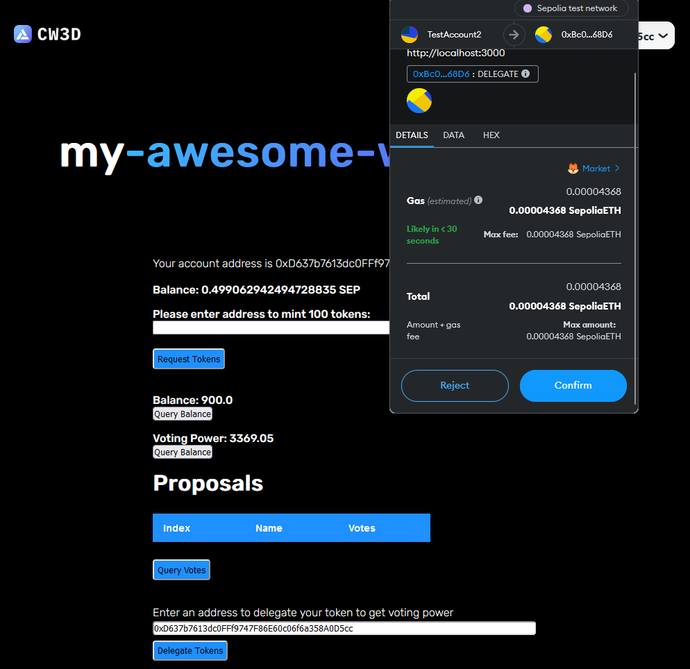
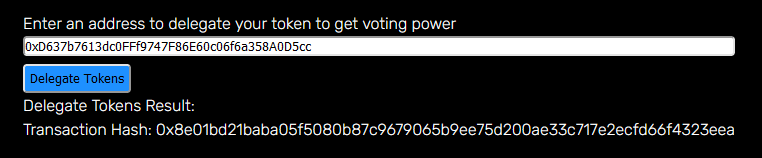
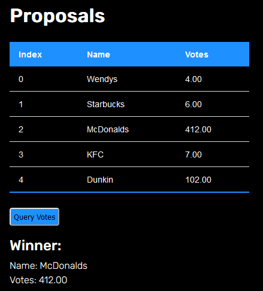
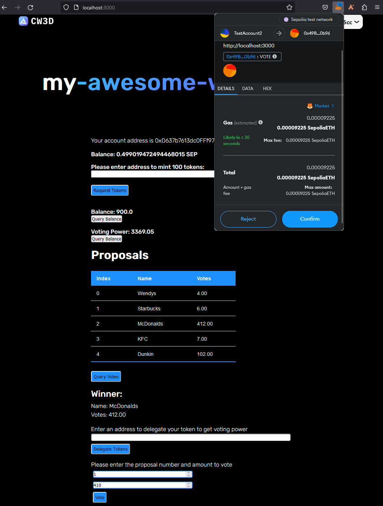
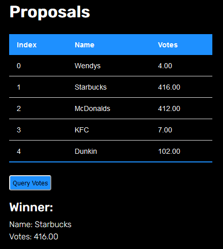

# Group 12

### _Contributors_

- Jonathan Meyer | mwjeth#7039
- Andy | 0xAndy#3968
- Beatriz Dominguez | BeatrizD#8939
- Anuja | anud#1704
- Pedro | pdroooooooo#5705
- BK | BK#7471
- Neeraj | innerpeace#5319

---

### Voting dApp Repository [Github Repo](https://github.com/Encode-Solidity-Bootcamp-Group-12)

### The contracts used for this voting dApp are deployed on Sepolia Testnet. The addresses are below. 
#### The MyERC20Votes' contract address is: [`0xBc04B42E46366716841Afd78728a712AC8c768D6`](https://sepolia.etherscan.io/address/0xBc04B42E46366716841Afd78728a712AC8c768D6)
#### The Tokenized Ballot contract address is:  [`0x49Bc0068Cb198C45fBE4D272bc690e933C2f0b96`](https://sepolia.etherscan.io/address/0x49Bc0068Cb198C45fBE4D272bc690e933C2f0b96)

#### Vote for your favorite food chain:

- Proposal 0 - Wendys
- Proposal 1 - Starbucks
- Proposal 2 - McDonalds
- Proposal 3 - KFC
- Proposal 4 - Dunkin

---
**Below you can find what the user sees after they have connected their wallet address. They can see their connected address, sepolia balance, they can request tokens, query their balance and their voting power.**
  - > 

**The user can enter their wallet address and mint tokens.**
  - > 
  
**After the tokens have been succesfully minted, they will receive a succesful transaction hash and message.**
  - > 

**The user can delegate those minted tokens to their account and get voting power.**
  - > 
  
**After the tokens have been successfully delegated, they will receive a succesful transaction and message. Now the user has voting power!**
  - > 

**Here you can see the results before voting where McDonalds was in the lead.**
  - > 

**The user can vote by choosing the proposal number they want to vote for and entering the amount of tokens.**
  - > 

**You can find the final results below, where Starbucks is still the winner!**
  - > 

